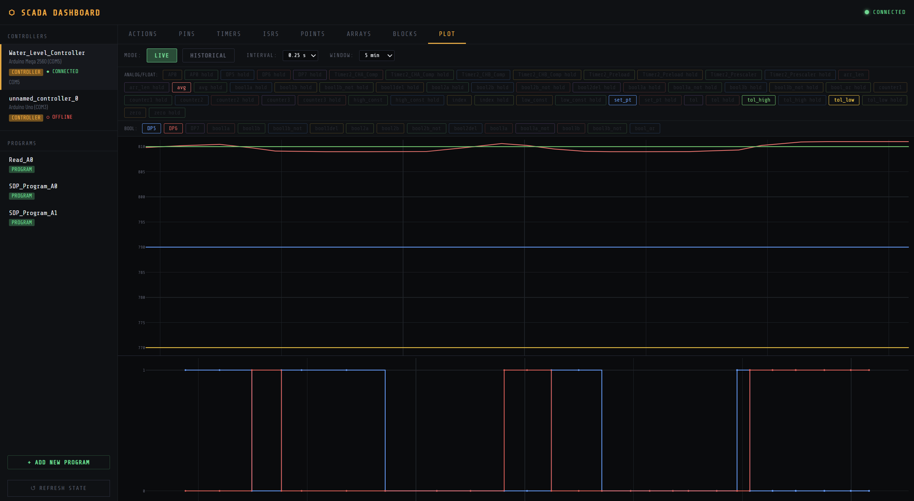
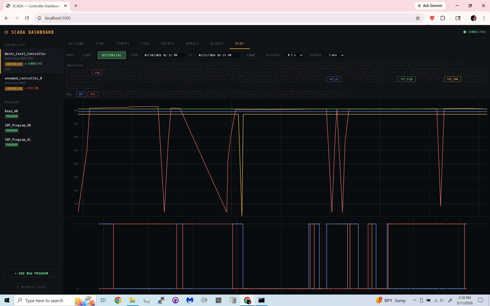

# SDP_SCADA: A simple mini-scada system for Raspberry Pi deployment and Arduino controller usage

## Abstract
This project presents the design and implementation of a low-cost Supervisory Control and Data Acquisition (SCADA) and Distributed Control System (DCS) using consumer-grade hardware. The system recreates core functions of commercial industrial automation platforms by integrating Arduino Mega 2560 R3-based field devices with a Raspberry Pi Version 4 host responsible for system supervision, data processing, and user interface delivery. The architecture enables real-time monitoring and control while remaining significantly more affordable than traditional PLC-based solutions. The system’s performance demonstrates that reliable small-scale automation is achievable using widely available components, making the design suitable for educational, prototyping, and non-industrial applications. Ethical and professional considerations—including environmental impact, user safety, and cybersecurity limitations—are analyzed in accordance with the IEEE Code of Ethics. The results show that while consumer-grade hardware imposes clear limitations, the proposed system provides an accessible and economical platform for learning and experimentation with SCADA and DCS technologies.

## Dependencies
- python3
- arduino-cli : https://docs.arduino.cc/arduino-cli/

## Usage
To run the SCADA system, simply clone this GitHub repository onto a Windows or Linux device (such as a Raspberry Pi v4). The host system will need USB-A ports to connect to controller(s), as such a computer is another good choice. Run the python script SCADA.py (in the top directory) and that is it, the server is self deploying as all needed files will be generated when ran. A folder next to the repository folder called "SCADA_Data" will be created to store controller settings, code, and collected SQL data. To connect to the server open a web browser, and in the searchbar enter "http://{host-machine local ip}:5000", or if you are using the GUI from the host system enter "http://localhost:5000" instead. A GUI like the one shown below will result, showing all connected controllers, created programs, and a plot tab that allows you to view collected data.

<p align="center">

</p>

<p align="center">

</p>

## Expected File Tree
After running the entry point SCADA.py, the following file tree should populate. If it does not check the command window SCADA.py was launched from for errors.

```
SCADA
├── LaTeX
│   └── ... 		    (paper)
├── scripts
│   ├── templates
│   │ 	└── gui
│   ├── ... 		    (scripts and utils)
├── block_lib.json	(generated block library)
├── SCADA.pi		    (entry point)
SCADA_Data
├── dcs_info
│   └── ... 		    (JSON for each Arduino)
├── dcs_scripts
│   └── ... 		    (ino for each Arduino)
├── data.db			    (SQL database)
```

## Ackonwledgements
This project was developed as a Senior Design Project for the school of Electrical and Computer Engineering at California State Polytechnic University, Pomona under the supervision of Professor Olson. 

This code is free to use for any purposes, such as modification or improvement. This code comes with no gaurentees of security, functionality, or stability. All liabilities damages resulting from the use of this code are the responsibility of the user.

## Citation
If you found this paper or code to be useful or interesting and would like to cite it or derive from it, the citation (in BibTex) is shown below. This paper is not published as it is a class paper however it will be hosted here indefinitely:
```
@misc{SCADA_paper,
  author       = {Brandon Esebag, Karina Francis, Marlene Pimienta Herrera, Carlos Chavez, Armando Rodriguez, Steven Soto},
  title        = {Open Source SCADA and DCS System on Raspberry Pi Model 4 and Arduino Mega 2560 R3},
  year         = {2026},
  publisher    = {GitHub},
  journal      = {GitHub repository},
  howpublished = {\url{https://github.com/rancorjoy/SDP_SCADA}},
  note         = {GitHub repository}
}
```

